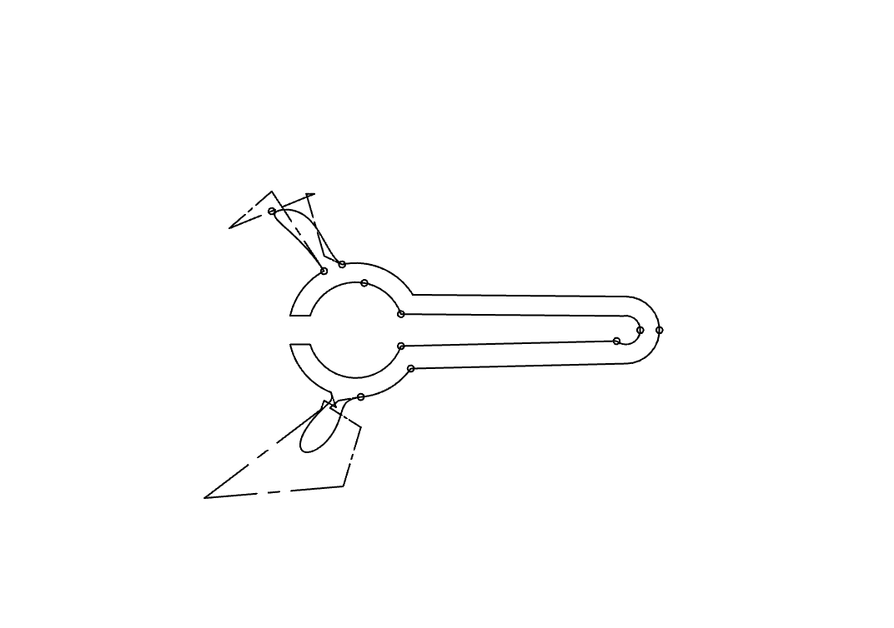
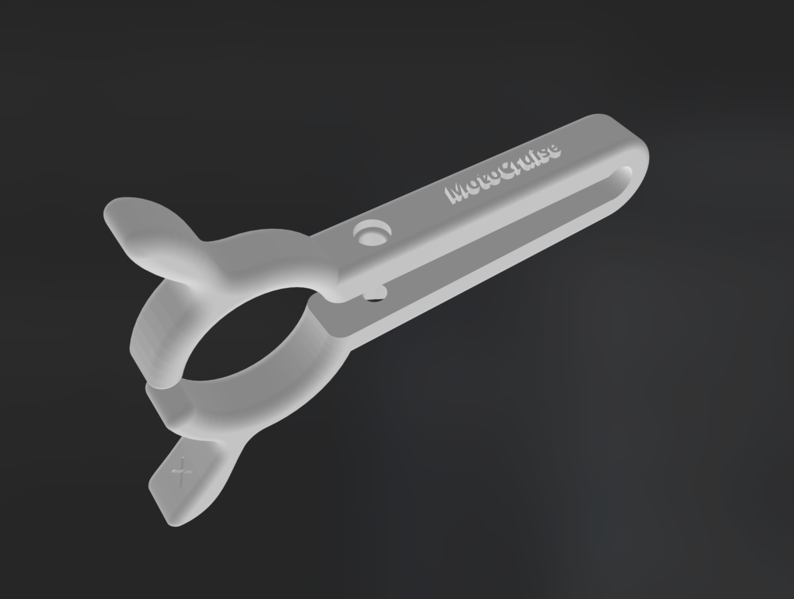
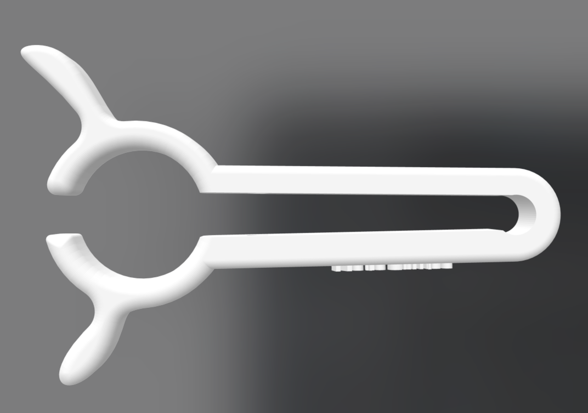

# MotoCruise

## Description

MotoCruise est un régulateur d'accélérateur de moto universel, conçu pour être simple à imprimer et à installer. Ce projet open source vise à offrir aux motards une solution pratique pour maintenir une vitesse constante sur de longues distances, réduisant ainsi la fatigue. Conçu avec OnShape, MotoCruise est facilement modifiable et adaptable pour différents modèles de motos. Nous invitons la communauté à imprimer leur propre régulateur en y apportant des modifications ou en le personnalisant, à partager leurs améliorations et à contribuer à ce projet collaboratif.

## Objectifs

- **Confort** : Réduire la fatigue des poignets lors des longs trajets en moto.
- **Accessibilité** : Offrir une solution facile à imprimer avec des matériaux accessibles.
- **Respect du code de la route** : Respect des limitations de vitesse en maintenant le niveau d'accélération à une position stable.
- **Collaboratif** : Encourager la communauté à contribuer à l'amélioration du design et à adapter le régulateur pour différents modèles de motos.

## Comment ça marche ?

MotoCruise utilise un mécanisme simple de came et ressort pour maintenir l'accélérateur en position. Une petite manette permet d'activer ou de désactiver le régulateur en toute simplicité. Voici les principales étapes d'utilisation :

1. **Impression** : Téléchargez les fichiers STL et imprimez les pièces avec un filament flexible (PolyFlex) et rigide (PLA).
2. **Assemblage** : Suivez les instructions d'assemblage pour monter le régulateur sur votre moto.
3. **Utilisation** : Utilisez le levier pour engager la came et maintenir l'accélérateur en position souhaitée.

## Installation

1. Téléchargez les fichiers STL depuis la section [Téléchargements](#).
2. Imprimez les pièces avec une imprimante 3D en utilisant du filament PolyFlex et PLA.
3. Suivez les instructions d'assemblage dans la section [Instructions d'assemblage](#) pour monter le régulateur sur votre moto.

## Instructions d'assemblage

Pour assembler et installer votre régulateur MotoCruise, suivez ces étapes simples. Assurez-vous de disposer de tous les outils et pièces nécessaires avant de commencer.

### Matériel nécessaire

- **Vis** : Diamètre 4 mm, tête ronde de diamètre 7,5 mm environ.
- **Boulon hexagonal** : Diamètre 7 mm.

### Étapes d'assemblage

1. **Préparation du boulon** :
   - Prenez le boulon hexagonal et insérez-le dans le trou hexagonal prévu à cet effet sur la pièce MotoCruise. Assurez-vous qu'il est bien en place et ne bouge pas.

2. **Positionnement de MotoCruise** :
   - Placez le régulateur MotoCruise autour de la poignée d'accélérateur de votre moto. 
   - Assurez-vous que la partie prévue pour le levier de frein est bien alignée et en place. Cela garantit que le régulateur est correctement positionné pour son fonctionnement optimal.

3. **Fixation avec la vis** :
   - Insérez la vis à travers le trou prévu et vissez-la dans le boulon que vous avez placé précédemment.
   - Serrez la vis jusqu'à ce que la poignée d'accélérateur soit maintenue en place lorsqu'elle est relâchée en position d'accélération. Attention à ne pas trop serrer pour permettre de tourner manuellement la poignée sans difficulté.

4. **Vérification du montage** :
   - Testez le régulateur en relâchant la poignée d'accélérateur pour vérifier qu'elle reste en position. 
   - Assurez-vous également que vous pouvez toujours tourner la poignée manuellement pour ajuster l'accélération.

5. **Entretien régulier** :
   - Vérifiez régulièrement le serrage de la vis pour vous assurer qu'il n'y a pas de relâchement. Cela garantit une utilisation continue en toute sécurité.

---

En suivant ces instructions, vous devriez pouvoir installer et utiliser votre régulateur MotoCruise avec succès. Pour des modifications ou des adaptations spécifiques, consultez la section [Contribution](#contribution) pour partager vos améliorations avec la communauté.

## Matériaux nécessaires

- **Filament PLA** : [Acheter ici](https://fr.rs-online.com/web/p/materiaux-pour-impression-3d/8320223)

## Conception

MotoCruise a été conçu avec OnShape pour une flexibilité et une précision optimales. Vous pouvez accéder aux fichiers de conception OnShape [ici](#) pour effectuer des modifications ou des adaptations selon vos besoins.

## Schémas et Images

## Contribution

Nous croyons en l'amélioration continue à travers la collaboration. Voici comment vous pouvez contribuer :

1. **Forker le dépôt** : Créez votre propre copie du projet pour y apporter des modifications.
2. **Soumettre des pull requests** : Proposez vos modifications et améliorations pour intégration dans le projet principal.
3. **Signaler des bugs** : Utilisez la section [Issues] pour signaler des problèmes ou des suggestions d'amélioration.
4. **Partager vos adaptations** : Nous encourageons les adaptations pour différents modèles de motos. Partagez vos versions personnalisées pour aider d'autres motards.

## Licence

Ce projet est sous licence [MIT](LICENSE), ce qui permet une utilisation, modification et distribution libre tout en respectant les conditions spécifiées.

## Contact

Pour toute question ou suggestion, n'hésitez pas à nous contacter via [email](mailto:contact@example.com) ou à ouvrir une issue sur GitHub.

## Remerciements

Merci à tous les contributeurs et à la communauté de motards pour leur soutien et leurs retours précieux.

---

*Restez connecté et participez à l'amélioration de MotoCruise ! Ensemble, rendons les trajets en moto plus confortables et agréables.*

---

## Liens utiles

- [Télécharger les fichiers STL](#)
- [Accéder aux fichiers OnShape](#)
- [Voir les instructions d'assemblage](#)
- [Contribuer au projet](#)
